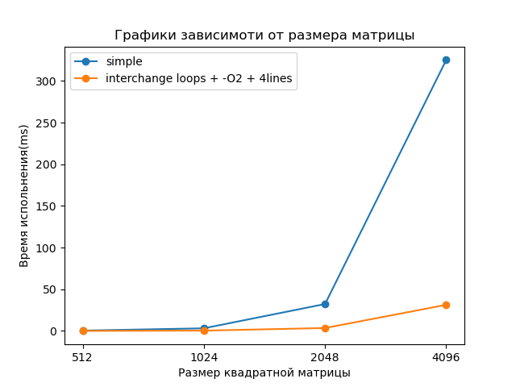
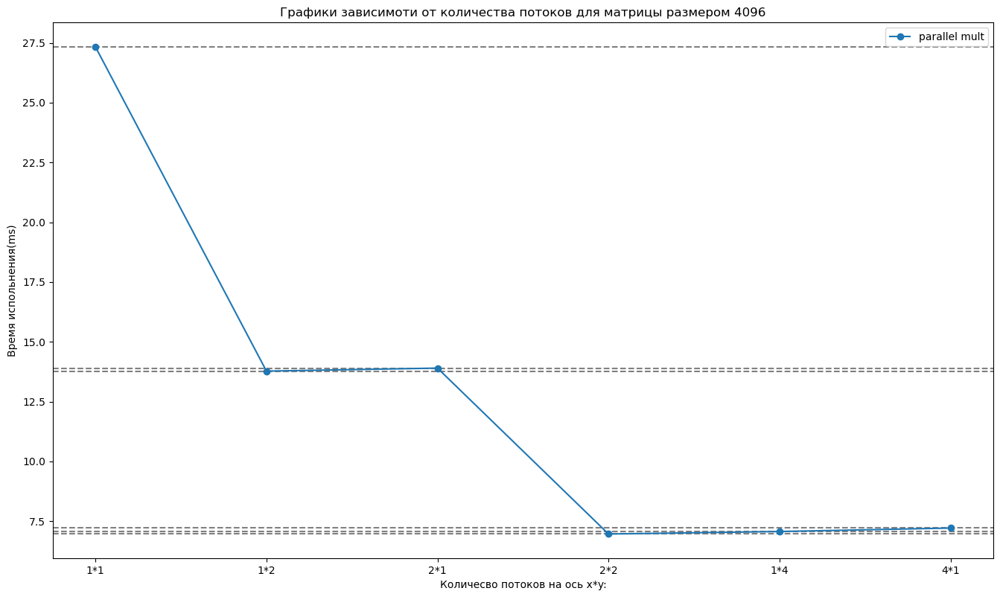

# Домашнее задание 1


## Блочное умножение матриц, дружелюбное к кэшу

Нужно написать на С (+ pthreads) или на C++11 обычное умножение матриц и блочное с параллелизмом. Для того и для другого — графики зависимости времени умножения от размера матрицы, для параллельного — график зависимости времени умножения от к-ва тредов для матрицы размером в 10 МБ. Векторизация и тому подобные техники — по желанию.

## Вопросы:

- Смысл кэша
- Холодное чтение
- Кэш-линия
- False sharing
- Значение порядка циклов
- Оптимальный размер блока
- Средства стандартной библиотеки / pthreads, которые вы используете

## Решение:

Сам код решением лежит [тут](main.c). Для компиляции использовать `gcc -pthread -O2 main.c -o a.exe` и при запуске надо указывать 3 аргумента, это размеры матриц если указать разнгые то вылетит ассерт, если использовать не степень двойти, то будет печально

Примитивное перемножение:
```c
void matrix_mult_simple(double** A, double** B, double** C, unsigned h1,
                        unsigned w1, unsigned w2) {
  for (unsigned i = 0; i < h1; ++i) {
    for (unsigned j = 0; j < w2; ++j) {
      for (unsigned k = 0; k < w1; ++k) {
        C[i][j] += A[i][k] * B[k][j];
      }
    }
  }
}
```

Перемножение с изменением порядка выполнения циклов и по блоку в 4 элемента:
```c
void matrix_mult(double** A, double** B, double** C, unsigned h1, unsigned w1,
                 unsigned w2) {
  for (unsigned i = 0; i < h1; ++i) {
    for (unsigned k = 0; k < w1; ++k) {
      for (unsigned j = 0; j < w2; j += 4) {
        C[i][j] += A[i][k] * B[k][j];
        C[i][j + 1] += A[i][k] * B[k][j + 1];
        C[i][j + 2] += A[i][k] * B[k][j + 2];
        C[i][j + 3] += A[i][k] * B[k][j + 3];
      }
    }
  }
}
```

Параллельное блочное перемножение с использованием нескольких потоков:
```c
#define BLOCK_SIZE 32

#define x_par 2
#define y_par 1
#define THREADS_NUM x_par*y_par

typedef struct {
  unsigned h1;
  unsigned x_start;
  double** A;
  double** B;
  double** C;
} Foo;

// preparetion
void matrix_mult_par_prep(Foo* datas, double** A, double** B, double** C,
                          unsigned h1, unsigned w1, unsigned w2) {
  for (unsigned i = 0; i < y_par; ++i) {
    for (unsigned j = 0; j < x_par; ++j) {
      Foo data = {h1, j * w1 / x_par, A + (i * h1 / y_par), B, C + (i * h1 / y_par)};
      datas[i * x_par + j] = data;
    }
  }
}

void* matrix_mult_par_task(void* arg) {
  if (!arg) {
    return NULL;
  }
  Foo* data = (Foo*)arg;

  const unsigned y_step = data->h1 / y_par;
  const unsigned x_step = data->h1 / x_par;

  for (unsigned i = 0; i < y_step; i += BLOCK_SIZE) {
    for (unsigned j = data->x_start; j < (data->x_start + x_step);
         j += BLOCK_SIZE) {
      for (unsigned k = 0; k < data->h1; k += BLOCK_SIZE) {
        for (unsigned il = 0; il < BLOCK_SIZE; ++il) {
          for (unsigned kl = 0; kl < BLOCK_SIZE; ++kl) {
            for (unsigned jl = 0; jl < BLOCK_SIZE; jl += 4) {
              data->C[i + il][j + jl] +=
                  data->A[i + il][k + kl] * data->B[k + kl][j + jl];
              data->C[i + il][j + jl + 1] +=
                  data->A[i + il][k + kl] * data->B[k + kl][j + jl + 1];
              data->C[i + il][j + jl + 2] +=
                  data->A[i + il][k + kl] * data->B[k + kl][j + jl + 2];
              data->C[i + il][j + jl + 3] +=
                  data->A[i + il][k + kl] * data->B[k + kl][j + jl + 3];
            }
          }
        }
      }
    }
  }
  pthread_exit(NULL);
}

void matrix_mult_par(Foo* datas, pthread_t* threads) {
  for (unsigned i = 0; i < y_par; ++i) {
    for (unsigned j = 0; j < x_par; ++j) {
      pthread_create(threads + i * x_par + j, NULL, matrix_mult_par_task,
                     (void*)(datas + i * x_par + j));
    }
  }
  for (unsigned i = 0; i < THREADS_NUM; ++i) {
    pthread_join(threads[i], NULL);
  }
}
```

Замерил все данные и построил следующие графики:
```py
import matplotlib.pyplot as plt

def plot_mult_graph(data):
  for key, values in data.items():
    x_values = ['512', '1024', '2048', '4096']

    plt.plot(x_values, values, label=key, marker='o')

  plt.xlabel("Размер квадратной матрицы")
  plt.ylabel("Время испольнения(ms)")
  plt.title("Графики зависимоти от размера матрицы")
  plt.legend()

  plt.show()

if __name__ == "__main__":
  data_mult = {
     'simple': [0.390107, 3.157398, 32.283823, 325.226320],
     'interchange loops + -O2 + 4lines': [0.049683, 0.381112, 3.481426, 31.328179]
  }
  plot_mult_graph(data_mult)
```

```py
import matplotlib.pyplot as plt

def plot_par_mult_graph(data):
  x_values = []
  y_values = []
  for key, value in data.items():
    x_values.append(key)
    y_values.append(value)
    plt.axhline(value, color='gray', linestyle='--')
  plt.plot(x_values, y_values, label='parallel mult', marker='o')
  plt.xlabel("Количесво потоков на ось x*y:")
  plt.ylabel("Время испольнения(ms)")
  plt.title("Графики зависимоти от количества потоков для матрицы размером 4096")
  plt.legend()

  plt.show()

if __name__ == "__main__":
  data_mult_par = {
     '1*1': 27.336148,
     '1*2': 13.775800,
     '2*1': 13.901103,
     '2*2': 6.963705,
     '1*4': 7.067802,
     '4*1': 7.211670
  }
  plot_par_mult_graph(data_mult_par)
```

