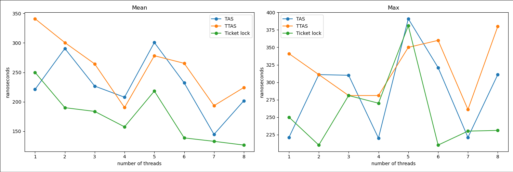

Реализовать TAS, TTAS & ticket lock с оптимизациями (pause, yield, backoff), построить графики -- среднее и максимальное время вхождения в крит. секцию от числа потоков. Обязательно корректная работа с барьерами памяти при обращении к атомарным переменным.

При сдаче буду спрашивать про барьеры памяти, отложенный эффект операций, синхронизацию кэшей, store buffer, invalidate queue, модели памяти C / C++, свойства операции compare_exchange, техники оптимизации, честность, чем ttas лучше tas.

Желающие получить балл побольше реализуют MCS lock / CLH lock.

Решение лежит в файле `main.cpp` 

Построены графики сравнения при разных видах спинлока
